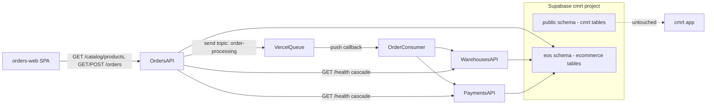

# E-Commerce Orders Service — Implementation Design Plan

Deliverable: [`IMPLEMENTATION_DESIGN_PLAN.md`](IMPLEMENTATION_DESIGN_PLAN.md) in repo root (alongside [`PRODUCT-REQUIREMENTS-DOCUMENT.md`](PRODUCT-REQUIREMENTS-DOCUMENT.md)).

Reference architecture: [cad-model-review-tool](https://github.com/RavenHursT/cad-model-review-tool) (Turborepo + pnpm + NestJS on Vercel + Prisma + Supabase + GitHub Actions).

---

## System Overview

Three independently deployable NestJS APIs plus a **Vite React SPA** (`orders-web`), **existing Supabase project `cmrt`** (ref `zyhntpqedmairqkpummv`) with a dedicated **`eos` Postgres schema** for all ecommerce tables — fully isolated from cmrt's `public` schema (`comments`, etc.), async order processing via [Vercel Queues](https://vercel.com/docs/queues/api).



**Order lifecycle (confirmed: sequential payment)**

1. `POST /orders` — validate (Zod), persist order as `PENDING`, enqueue message, return `201 Created` (credit card fields accepted but **not** stored; only passed through queue payload to consumer).
2. Queue consumer — set `PROCESSING`, call Warehouses API.
3. If warehouse returns `UNFULFILLABLE` → update order to `UNFULFILLABLE`, **skip payment**, done.
4. If warehouse returns `ACCEPTED` → update order to `FULFILLABLE` (warehouse + shipment details persisted), then call Payments API.
5. If payment succeeds → update order to `PAYMENT_COMPLETE` (terminal success). If payment fails → `PAYMENT_FAILED` (terminal failure; order remains at `FULFILLABLE` until updated, or set directly to `PAYMENT_FAILED` with fulfillment data retained).

---

## Monorepo Layout

```
ecommerce-orders-service/
├── apps/
│   ├── orders-api/          # NestJS + Vercel serverless entry (api/index.ts)
│   ├── warehouses-api/
│   ├── payments-api/
│   └── orders-web/          # Vite + React + TypeScript + Tailwind + ShadCN (Phase 8)
│       ├── components.json  # shadcn CLI config (style, aliases, tailwind paths)
│       ├── src/
│       │   ├── api/         # typed fetch client for Orders API
│       │   ├── components/
│       │   │   ├── ui/      # shadcn primitives (Button, Card, Form, Select, Badge, …)
│       │   │   ├── order-form.tsx
│       │   │   ├── order-list.tsx
│       │   │   ├── line-item-row.tsx
│       │   │   ├── status-badge.tsx
│       │   │   └── mode-toggle.tsx
│       │   ├── providers/
│       │   │   └── theme-provider.tsx   # next-themes wrapper
│       │   ├── lib/
│       │   │   └── utils.ts             # cn() helper (clsx + tailwind-merge)
│       │   ├── hooks/                   # useOrders, useCatalog (optional)
│       │   ├── App.tsx                  # single-page layout (form + list)
│       │   └── index.css                # Tailwind + shadcn CSS variables (light/dark)
│       ├── index.html
│       ├── vite.config.ts               # @tailwindcss/vite plugin + @/ alias
│       ├── vercel.json      # SPA fallback rewrites
│       └── package.json     # name: @repo/orders-web
├── packages/
│   ├── database/            # Single Prisma schema, migrations, seed (all domains)
│   ├── schemas/             # Shared Zod request/response schemas
│   └── typescript-config/   # Shared tsconfig bases
├── .github/workflows/
│   ├── quality.yml          # lint, typecheck, build
│   └── migrate.yml          # prisma migrate deploy (single DB)
├── turbo.json
├── pnpm-workspace.yaml
├── .env.example             # Keys only, empty values (committed)
├── .gitignore               # Includes .env.local
└── README.md
```

**NestJS on Vercel pattern** (from reference): each app has `api/index.ts` that lazily bootstraps Express via `createApp()` from `src/bootstrap.ts`, with `vercel.json` rewrites `/(.*) → /api`.

**Queue consumer** (Orders app only): separate serverless route `apps/orders-api/api/queues/process-order.ts` using `@vercel/queue` `handleCallback`, wired in `vercel.json`:

```json
{
  "functions": {
    "api/queues/process-order.ts": {
      "experimentalTriggers": [{ "type": "queue/v2beta", "topic": "order-processing" }]
    }
  }
}
```

Producer uses `send('order-processing', payload, { idempotencyKey: orderId })` from `@vercel/queue`.

---

## Supabase Database (`cmrt` project + `eos` schema)

**No new Supabase project.** Reuse the existing **`cmrt`** project (ref `zyhntpqedmairqkpummv`, region `us-east-1`). Supabase provides one Postgres database per project; isolation from the cmrt app is achieved via a **separate PostgreSQL schema** named `eos`.

| Schema | Owner app | Tables | Notes |
|--------|-----------|--------|-------|
| `public` | [cad-model-review-tool](https://github.com/RavenHursT/cad-model-review-tool) | `comments`, … | **Must not be modified** by this repo |
| `eos` | ecommerce-orders-service | see below | All Prisma migrations target **only** this schema |

| Domain | Tables (in `eos` schema) | Used by |
|--------|--------------------------|---------|
| Orders | `eos.orders`, `eos.order_items` | `orders-api` |
| Warehouses | `eos.warehouses`, `eos.products`, `eos.warehouse_inventory` | `warehouses-api` |
| Payments | `eos.payment_authorizations` | `payments-api` |

**Why schema isolation (not a second database):**
- Supabase free tier allows only 2 active projects (both slots in use); a dedicated `eos` project is not available without pausing/deleting another project.
- A separate `eos` schema provides logical isolation: cmrt migrations never touch `eos.*`; ecommerce migrations never touch `public.*`.
- Same `DATABASE_URL` / `DIRECT_URL` as cmrt (pooler host `aws-1-us-east-1`); only the Postgres schema differs.

**Prisma multi-schema setup** ([`packages/database/prisma/schema.prisma`](packages/database/prisma/schema.prisma)):
```prisma
generator client {
  provider        = "prisma-client"
  output          = "../generated/prisma"
  previewFeatures = ["multiSchema"]
}

datasource db {
  provider = "postgresql"
  schemas  = ["eos"]
}

model Order {
  // ...
  @@schema("eos")
  @@map("orders")
}
```

**Migration safety rules:**
- Phase 1 migration: `CREATE SCHEMA IF NOT EXISTS eos;` only
- Phase 2+ migrations: all DDL confined to `eos` schema (Prisma `@@schema("eos")` on every model)
- Never run `prisma migrate` against cmrt's `packages/database` from this repo
- Verify via Supabase MCP `list_tables` with `schemas: ["eos"]` — confirm zero changes to `public` tables

**Connection conventions** (same pooler URLs as cmrt):
- `DATABASE_URL` — PgBouncer pooler (port 6543, `?pgbouncer=true`)
- `DIRECT_URL` — direct connection (port 5432) for Prisma migrations
- No RLS — access control is application-layer only (NestJS services)
- Single Prisma package at `packages/database`; migrations under `prisma/migrations/`

**Environment files:**
- `.env.example` — committed template listing every required key with **empty values** (e.g. `DATABASE_URL=`)
- `.env.local` — developer-local file with **real** connection strings and secrets; listed in `.gitignore`, never committed
- Vercel project env vars and GitHub Actions secrets hold production/CI values

**Platform tooling — Supabase MCP + Vercel MCP/CLI (preferred for ops/verification):**

Use integrated MCP tools and CLI during implementation instead of manual dashboard steps where possible. Prisma migrations/seeds still run via `pnpm db:migrate` / `pnpm db:seed`; MCP confirms results. Vercel deploys can be triggered via GitHub integration, **Vercel MCP**, or **`vercel` CLI** (`vercel link`, `vercel deploy`, `vercel env pull`).

**Supabase** — MCP integration + [Supabase agent skill](https://supabase.com/docs/guides/getting-started/ai-skills):

| Task | Tool |
|------|------|
| Inspect cmrt / eos schemas | MCP `list_tables` with `schemas: ["public", "eos"]` |
| Create eos schema | MCP `apply_migration` or Prisma migrate (`CREATE SCHEMA IF NOT EXISTS eos`) |
| Verify seed data | MCP `execute_sql` (e.g. `SELECT count(*) FROM eos.warehouses`) |
| Confirm public untouched | MCP `list_tables` with `schemas: ["public"]` — row counts unchanged |
| Apply/check migrations | MCP `apply_migration`, `list_migrations` |
| Security/perf checks | MCP `get_advisors` |

Follow Supabase skill guidance (verify after changes, pooler URL for runtime, direct URL for migrations).

**Vercel** — MCP integration + **`vercel` CLI**:

| Task | Tool |
|------|------|
| Link local repo to project | CLI `vercel link` |
| Create/deploy projects | MCP `deploy_to_vercel` or CLI `vercel deploy` |
| List/inspect projects | MCP `list_projects`, `get_project` |
| Check deployment status | MCP `list_deployments`, `get_deployment` |
| Debug failed builds | MCP `get_deployment_build_logs`, `get_runtime_logs` |
| Pull env vars locally | CLI `vercel env pull` → merges into `.env.local` |
| Queues / platform docs | MCP `search_vercel_documentation` |
| Hit protected deployments | MCP `get_access_to_vercel_url`, `web_fetch_vercel_url` |

Enable **Vercel Queues** on the Orders project via dashboard or CLI after Orders project is linked. Local queue dev requires `vercel env pull` (OIDC tokens land in `.env.local`).

**Service boundary enforcement:** Each NestJS app imports `@repo/database` but exposes only domain-specific repositories (e.g. `OrdersRepository`, `WarehousesRepository`, `PaymentsRepository`) so no service directly mutates another domain's tables — cross-domain coordination happens exclusively via HTTP between services.

---

## Data Models

All models live in [`packages/database/prisma/schema.prisma`](packages/database/prisma/schema.prisma) with `@@schema("eos")` on every model and enum.

### Orders domain

| Model | Key fields |
|-------|------------|
| `Order` | `id`, `status` enum, customer fields, shipping address (JSON or columns), `totalAmount`, `warehouseId?`, `paymentAuthorizationId?`, fulfillment/shipment details, timestamps |
| `OrderItem` | `orderId`, `productId`, `quantity`, `unitPrice` (snapshot at order time) |

**OrderStatus enum:**

```
PENDING → PROCESSING → FULFILLABLE → PAYMENT_COMPLETE   (happy path)
                     ↘ UNFULFILLABLE                    (terminal — warehouse)
                        FULFILLABLE → PAYMENT_FAILED    (terminal — payment declined)
PENDING → CANCELLED                                       (client cancel before processing)
```

| Status | Meaning |
|--------|---------|
| `PENDING` | Created, queued, not yet picked up by consumer |
| `PROCESSING` | Consumer active; warehouse evaluation in flight |
| `FULFILLABLE` | Warehouse assigned; shipment details recorded; awaiting or during payment |
| `PAYMENT_COMPLETE` | Payment authorized; order fully processed (terminal success) |
| `UNFULFILLABLE` | No warehouse can fulfill all items (terminal failure) |
| `PAYMENT_FAILED` | Warehouse OK but payment declined (terminal failure) |
| `CANCELLED` | Soft-cancelled by client while still `PENDING` |

**Note:** The Warehouses API response vocabulary remains `ACCEPTED` / `UNFULFILLABLE` — the Orders service maps warehouse `ACCEPTED` → order status `FULFILLABLE`.

### Warehouses domain

| Model | Key fields |
|-------|------------|
| `Warehouse` | `id`, `name`, `address`, `latitude`, `longitude` |
| `Product` | `id`, `sku`, `name`, `unitPrice` |
| `WarehouseInventory` | `warehouseId`, `productId`, `quantity` (unique composite) |

### Payments domain

| Model | Key fields |
|-------|------------|
| `PaymentAuthorization` | `id`, `orderId`, `amount`, `cardLastFour`, `description`, `status` (`AUTHORIZED` / `DECLINED`), `authorizationCode?` |

---

## API Surface

### Orders API (`apps/orders-api`) — public

| Method | Path | Phase | Notes |
|--------|------|-------|-------|
| GET | `/health` | 1 | DB ping + downstream Warehouses and Payments `/health` |
| GET | `/catalog/products` | 8 | Public product catalog with stock (BFF → Warehouses) |
| GET | `/orders` | 5 | Paginated list |
| GET | `/orders/:id` | 5 | Single order + items |
| POST | `/orders` | 6 | Create + enqueue; `201` |
| PATCH | `/orders/:id` | 5 | Only when `PENDING` (address/customer corrections) |
| DELETE | `/orders/:id` | 5 | Soft-cancel when `PENDING` |

**POST /orders body (Zod in `packages/schemas`):**
```typescript
{
  customer: { name: string; email: string };
  shippingAddress: { line1: string; line2?: string; city: string; state: string; postalCode: string; country: string };
  items: { productId: string; quantity: number }[];
  payment: { cardNumber: string; description?: string };
}
```

Server computes `totalAmount` from Warehouses product prices (fetched at create time via internal HTTP call, or validated against cached price lookup endpoint).

**CORS (Phase 8):** enable on [`apps/orders-api/src/bootstrap.ts`](apps/orders-api/src/bootstrap.ts) for SPA origins via `CORS_ALLOWED_ORIGINS` (comma-separated; local `http://localhost:5173`, production `https://eos-orders-web.vercel.app`).

### Warehouses API (`apps/warehouses-api`) — internal

| Method | Path | Phase | Notes |
|--------|------|-------|-------|
| GET | `/health` | 1 | DB ping |
| POST | `/fulfillment/evaluate` | 3 | Core PRD logic |
| GET | `/products` | 8 | **New** — list all products with `availableQuantity` (internal, API-key gated) |
| GET | `/products/:id` | 3 | Price lookup for order total calculation |

**POST /fulfillment/evaluate** — always `200 OK`:
```typescript
// ACCEPTED
{ status: "ACCEPTED", warehouseId, warehouseName, distanceKm, estimatedShipment: { ... } }
// UNFULFILLABLE
{ status: "UNFULFILLABLE", reason: "NO_WAREHOUSE_WITH_FULL_INVENTORY" }
```

**Fulfillment algorithm:**
1. Forward-geocode shipping address via **Google Maps Geocoding API** (`@googlemaps/google-maps-services-js`) → `{ lat, lng }`. Address is formatted from `shippingAddress` fields; `components=country:{country}` scopes results. Requires `GOOGLE_MAPS_API_KEY` on `eos-warehouses-api` only (GCP billing + Geocoding API enabled; API key restricted to Geocoding API).
2. Query warehouses with sufficient inventory for **all** line items (intersect per-product warehouse IDs).
3. If none → `UNFULFILLABLE`.
4. Else pick minimum Haversine distance to shipping coords.

**`GET /products` response (Phase 8)** — in [`packages/schemas/src/product.ts`](packages/schemas/src/product.ts):
```typescript
// productCatalogItemSchema
{ id, sku, name, unitPrice, availableQuantity }
// productCatalogResponseSchema
{ data: ProductCatalogItem[] }
```

**`availableQuantity` definition:** for each product, `MAX(warehouse_inventory.quantity)` across warehouses — the most stock available at any single warehouse. Aligns with the PRD rule that an order must ship from one warehouse.

**Orders API BFF:** `GET /catalog/products` proxies to Warehouses `GET /products` via [`WarehousesClient`](apps/orders-api/src/warehouses/warehouses.client.ts). SPA never receives `INTERNAL_API_KEY`.

### Payments API (`apps/payments-api`) — internal

| Method | Path | Phase | Notes |
|--------|------|-------|-------|
| GET | `/health` | 1 | DB ping |
| POST | `/payments/authorize` | 4 | Mock charge |

**Mock rules:** card ending `0000` → `DECLINED`; otherwise `AUTHORIZED` with generated `authorizationCode`. Persist to `eos.payment_authorizations`; return `{ status, authorizationId, cardLastFour }`. **Never persist full card number** — only last 4 in payments table; Orders service stores `paymentAuthorizationId` on the `eos.orders` row only.

---

## Cross-Service Communication

- Env vars per app: `WAREHOUSES_API_URL`, `PAYMENTS_API_URL` (Orders); optional `ORDERS_API_URL` unused initially.
- Service-to-service auth: shared `INTERNAL_API_KEY` header (`x-internal-api-key`) validated by NestJS guard on Warehouses/Payments routes.
- Vercel deployment protection: mirror reference project pattern — `AUTOMATION_BYPASS_*` env vars for CI and inter-service health checks.

---

## Shared Packages

### `packages/schemas`
- Zod schemas for all request/response bodies
- NestJS integration via `nestjs-zod` or manual `schema.parse()` in pipes
- Exported types via `z.infer<>`

### `packages/database`
- Single Prisma schema with all domain models in **`eos` schema** (`multiSchema` preview)
- Shared `PrismaService` singleton; domain repositories per app
- `db:generate`, `db:migrate`, `db:seed` scripts wired through Turbo (one migration history, eos-only DDL)

---

## Prisma Seeds (Phase 2)

**Warehouses seed** — 3 warehouses at different US coords, 50 products, varied inventory so test cases cover:
- All items fulfillable from closest warehouse (NYC order → East Coast warehouse)
- Fulfillable only from farther warehouse
- One product out of stock everywhere → `UNFULFILLABLE`

**Orders seed** — 1-2 sample orders in `PENDING` and `PAYMENT_COMPLETE` for GET endpoint testing.

**Payments seed** — optional historical authorization records linked to seeded order IDs.

Run: `pnpm db:seed` (single seed script covering all domains).

---

## CI/CD and Deployment

### GitHub Actions
- **quality.yml** — on push/PR: `pnpm turbo lint typecheck build`
- **migrate.yml** — on push to `main` when `packages/database/prisma/migrations/` changes: `prisma migrate deploy` (secrets: `DATABASE_URL`, `DIRECT_URL`)

### Vercel (4 projects, GitHub integration)

| Vercel Project | Root Directory | Build Filter |
|----------------|----------------|--------------|
| `eos-orders-api` | repo root | `@repo/orders-api` |
| `eos-warehouses-api` | repo root | `@repo/warehouses-api` |
| `eos-payments-api` | repo root | `@repo/payments-api` |
| `eos-orders-web` | repo root | `@repo/orders-web` |

**Backend** `vercel.json` (each NestJS app):
```json
{
  "installCommand": "cd ../.. && pnpm install --frozen-lockfile",
  "buildCommand": "cd ../.. && pnpm turbo build --filter=@repo/orders-api",
  "rewrites": [{ "source": "/(.*)", "destination": "/api" }]
}
```

**SPA** [`apps/orders-web/vercel.json`](apps/orders-web/vercel.json):
```json
{
  "installCommand": "cd ../.. && pnpm install --frozen-lockfile",
  "buildCommand": "cd ../.. && pnpm turbo build --filter=@repo/orders-web",
  "outputDirectory": "dist",
  "rewrites": [{ "source": "/(.*)", "destination": "/index.html" }]
}
```

**Vercel env — `eos-orders-web` (Production + Preview):**
- `VITE_ORDERS_API_URL` = `https://eos-orders-api.vercel.app`

**Vercel env — `eos-orders-api` (add in Phase 8):**
- `CORS_ALLOWED_ORIGINS` = SPA production + preview URLs (comma-separated)

Enable **Vercel Queues** on the Orders project only. Monitor via project **Observability → Queues** tab.

---

## Phased Implementation

### Phase 1 — Monorepo Scaffold + cmrt Supabase + `eos` Schema + Health Endpoints
**Goal:** Connected to existing **cmrt** Supabase project with **`eos` schema created**; all three apps deployable on Vercel with operational `GET /health` endpoints in **both local dev and production**. **Zero changes to cmrt `public` schema.**

**Work:**

**Supabase (configure cmrt + create `eos` schema):**
- Reuse existing **cmrt** Supabase project (ref `zyhntpqedmairqkpummv`) — **do not** create a new project
- Copy `DATABASE_URL` and `DIRECT_URL` from cmrt project Connect dialog (same pooler host `aws-1-us-east-1` as [cad-model-review-tool](https://github.com/RavenHursT/cad-model-review-tool))
- Document env var **keys only** (empty values) in [`.env.example`](.env.example)
- Create [`.env.local`](.env.local) with the real cmrt connection strings for local development
- Add `.env.local` to [`.gitignore`](.gitignore)
- Add the same secrets to **all 3 Vercel projects** and **GitHub Actions secrets**
- Run initial migration: `CREATE SCHEMA IF NOT EXISTS eos;` (via Prisma or Supabase MCP `apply_migration`)
- Verify connectivity with `pnpm db:generate` and health ping `SELECT 1` (no domain tables yet)
- Verify cmrt isolation: MCP `list_tables` on `public` — `comments` table unchanged

**Monorepo + apps:**
- Initialize pnpm + Turbo monorepo (Node 22, pnpm 11.x)
- Scaffold **all three** NestJS apps (`orders-api`, `warehouses-api`, `payments-api`) with Vercel serverless adapter (`api/index.ts` + `vercel.json` rewrites)
- Add `packages/database` with minimal Prisma setup (`multiSchema`, `schemas = ["eos"]`, datasource only — no domain models yet) wired to cmrt URLs
- Implement `GET /health` on **each** service:
  - `{ status: "ok", db: "connected" }` via `SELECT 1` against the shared Supabase database
  - Warehouses and Payments: standalone DB ping only
  - Orders: DB ping **plus** cascade calls to `GET ${WAREHOUSES_API_URL}/health` and `GET ${PAYMENTS_API_URL}/health`, returning `dependencies.warehouses` and `dependencies.payments` in the response (overall status `ok` only when all three pass)
- Root `pnpm dev` runs all three apps locally (ports 3001, 3002, 3003)
- Create and deploy **all 3** Vercel projects via **Vercel MCP** / **`vercel` CLI** / GitHub integration; configure env vars (`DATABASE_URL`, `DIRECT_URL`, inter-service URLs) per deployment using CLI `vercel env add` or dashboard
- GitHub Actions quality workflow (`lint`, `typecheck`, `build`)

**Verify (Supabase MCP — cmrt isolation):**
```bash
pnpm db:generate
# Prisma client generates against cmrt with multiSchema / eos
```
- `list_tables` with `schemas: ["eos"]` — schema exists (may be empty until Phase 2)
- `list_tables` with `schemas: ["public"]` — only cmrt tables (`comments`), unchanged

**Verify (local):**
```bash
curl http://localhost:3002/health
# → { status: "ok", db: "connected" }

curl http://localhost:3003/health
# → { status: "ok", db: "connected" }

curl http://localhost:3001/health
# → { status: "ok", db: "connected", dependencies: { warehouses: { status: "ok", db: "connected" }, payments: { status: "ok", db: "connected" } } }
```

**Verify (Vercel — MCP or curl against deployment URLs):**
- MCP `list_deployments` / `get_deployment` — confirm all 3 projects deployed successfully
- MCP `get_deployment_build_logs` — debug if any build fails
- Curl health endpoints against live URLs (or MCP `web_fetch_vercel_url` for protected deployments):
```bash
curl https://<warehouses-vercel-url>/health
curl https://<payments-vercel-url>/health
curl https://<orders-vercel-url>/health
# → Orders response includes live downstream health from deployed Warehouses + Payments URLs
```

---

### Phase 2 — Domain Tables in `eos` Schema, Migrations, Seeds
**Goal:** Production-ready domain tables in **`eos` schema only** with seed data. cmrt `public` schema untouched. Health endpoints from Phase 1 continue to work unchanged.

**Work:**
- Expand Prisma schema with all domain models, each with `@@schema("eos")`
- Initial domain migration creates tables exclusively in `eos` (no RLS policies)
- Single Prisma seed script targeting `eos.*` tables
- Post-migrate verification: confirm `public.comments` row count unchanged

**Verify:**
```bash
pnpm db:migrate && pnpm db:seed
curl http://localhost:3001/health   # still ok (health uses SELECT 1, not domain tables)
```

**Verify (Supabase MCP):**
- `list_tables` with `schemas: ["eos"]` — confirm `orders`, `order_items`, `warehouses`, `products`, `warehouse_inventory`, `payment_authorizations`
- `execute_sql` — e.g. `SELECT count(*) FROM eos.warehouses`, `SELECT count(*) FROM eos.products`
- `list_tables` with `schemas: ["public"]` — cmrt tables unchanged

---

### Phase 3 — Warehouses Fulfillment API
**Goal:** PRD warehouse selection logic.

**Work:**
- `packages/schemas`: `EvaluateFulfillmentRequest/Response`, `ProductResponse`
- **Google Geocoding** (`apps/warehouses-api/src/geocoding/google-geocoding.service.ts`):
  - SDK: [`@googlemaps/google-maps-services-js`](https://github.com/googlemaps/google-maps-services-js) (official server-side client)
  - Env: `GOOGLE_MAPS_API_KEY` — **warehouses-api only** (local `.env.local` + Vercel `eos-warehouses-api` Production/Preview)
  - GCP setup: enable **Geocoding API**, link billing, create API key restricted to Geocoding API only (Application restrictions: None for Vercel serverless)
  - Cost guard: set daily quota in [Google Maps Platform → Quotas](https://console.cloud.google.com/google/maps-apis/quotas) (~330/day ≈ 10k/month free tier as of March 2025)
  - Errors: `ZERO_RESULTS` → 400; `OVER_QUERY_LIMIT` → 503; missing key → 500
- Haversine distance utility
- `POST /fulfillment/evaluate` + `GET /products/:id`
- Internal API key guard (`x-internal-api-key`; `INTERNAL_API_KEY` on all 3 Vercel projects)

**Verify:**
```bash
# Fulfillable (seeded product UUID + NYC address)
curl -X POST http://localhost:3002/fulfillment/evaluate \
  -H "Content-Type: application/json" \
  -H "x-internal-api-key: $INTERNAL_API_KEY" \
  -d '{ "shippingAddress": { "line1": "350 Fifth Avenue", "city": "New York", "state": "NY", "postalCode": "10118", "country": "US" }, "items": [{ "productId": "<uuid>", "quantity": 1 }] }'
# → 200 { status: "ACCEPTED", warehouseId: "...", warehouseName: "Newark Distribution Center", distanceKm: ~15.8, estimatedShipment: { ... } }

# Production (same payload; requires INTERNAL_API_KEY + GOOGLE_MAPS_API_KEY on Vercel)
curl -X POST https://eos-warehouses-api.vercel.app/fulfillment/evaluate \
  -H "Content-Type: application/json" \
  -H "x-internal-api-key: $INTERNAL_API_KEY" \
  -d '{ ... }'

# Unfulfillable (quantity exceeds all inventory)
curl ... -d '{ ..., "items": [{ "productId": "<uuid>", "quantity": 9999 }] }'
# → 200 { status: "UNFULFILLABLE", reason: "NO_WAREHOUSE_WITH_FULL_INVENTORY" }

# Product lookup
curl http://localhost:3002/products/<uuid> -H "x-internal-api-key: $INTERNAL_API_KEY"
# → 200 { id, sku, name, unitPrice }
```

---

### Phase 4 — Payments Authorization API
**Goal:** Mock payment service with persistence.

**Work:**
- `POST /payments/authorize` with Zod validation
- Mock decline rule (card ending `0000`)
- Persist `PaymentAuthorization`; return authorization ID
- Internal API key guard

**Verify:**
```bash
curl -X POST http://localhost:3003/payments/authorize \
  -H "x-internal-api-key: $INTERNAL_API_KEY" \
  -d '{ "orderId": "test", "amount": 99.99, "cardNumber": "4111111111111111", "description": "Order test" }'
# → 200 { status: "AUTHORIZED", authorizationId: "...", cardLastFour: "1111" }

# Declined
curl ... -d '{ ..., "cardNumber": "4111111111110000" }'
# → 200 { status: "DECLINED" }
```

---

### Phase 5 — Orders CRUD (Sync)
**Goal:** Order entity management without async processing yet.

**Work:**
- Orders module: repository (Prisma), service, controller
- CRUD endpoints with Zod pipes
- On `POST /orders`: compute total from Warehouses `GET /products/:id`, persist `PENDING` (**no queue yet** — Phase 6 adds enqueue)
- PATCH/DELETE restricted to `PENDING` orders

**Verify:**
```bash
curl -X POST http://localhost:3001/orders -d '{ customer, shippingAddress, items, payment }'
# → 201 { id, status: "PENDING", totalAmount, items: [...] }

curl http://localhost:3001/orders
curl http://localhost:3001/orders/:id
curl -X PATCH http://localhost:3001/orders/:id -d '{ ... }'
curl -X DELETE http://localhost:3001/orders/:id
# → 204 or { status: "CANCELLED" }
```

---

### Phase 6 — Order Creation + Vercel Queue Publish
**Goal:** Async handoff on create.

**Work:**
- Install `@vercel/queue` in orders-api
- Configure topic `order-processing` + `vercel.json` trigger (consumer stub logs message)
- Update `POST /orders`: after persist, `send('order-processing', { orderId, payment: { cardNumber, description } })` with idempotency key = orderId
- Queue payload includes card number (ephemeral — never written to Orders DB)

**Verify:**
```bash
curl -X POST http://localhost:3001/orders -d '{ ... valid order ... }'
# → 201; Vercel dashboard / local logs show message received by consumer stub

curl http://localhost:3001/orders/:id
# → status still "PENDING" (consumer not fully wired yet)
```

---

### Phase 7 — Queue Consumer + Full Processing Pipeline
**Goal:** End-to-end order fulfillment per PRD.

**Work:**
- Implement `api/queues/process-order.ts` handler:
  1. Load order + items from DB; set `PROCESSING`
  2. Call Warehouses `POST /fulfillment/evaluate`
  3. If `UNFULFILLABLE` → update order status, store reason, **exit**
  4. If warehouse `ACCEPTED` → set order to `FULFILLABLE`, persist `warehouseId` + shipment details
  5. Call Payments `POST /payments/authorize` with card from queue payload + order total
  6. On payment success → `PAYMENT_COMPLETE` + `paymentAuthorizationId`; on decline → `PAYMENT_FAILED`
- Idempotent consumer (safe on retry — skip if already `PAYMENT_COMPLETE`, `UNFULFILLABLE`, or `PAYMENT_FAILED`; resume from `FULFILLABLE` if payment retry needed)
- Error handling: transient failures allow queue retry; terminal failures set `PAYMENT_FAILED`

**Verify:**
```bash
# Happy path
curl -X POST .../orders -d '{ valid items, card ending 1111 }'
# Poll GET /orders/:id until status = "PAYMENT_COMPLETE"
# → warehouseId populated, paymentAuthorizationId set

# Unfulfillable
curl -X POST .../orders -d '{ item qty 9999 }'
# → status = "UNFULFILLABLE", no paymentAuthorizationId

# Payment declined (warehouse was FULFILLABLE)
curl -X POST .../orders -d '{ valid items, card ending 0000 }'
# → status = "PAYMENT_FAILED", warehouseId still set
```

---

### Phase 8 — Orders Web SPA
**Goal:** Vercel-deployable React app for placing orders and viewing order status, fulfillment, and payment outcomes — built with **Tailwind CSS + ShadCN UI** and **persistent dark mode**.

**Prerequisite API work (same phase):**
- **Warehouses API:** `GET /products` — list products with `availableQuantity` (extend [`ProductsService`](apps/warehouses-api/src/products/products.service.ts))
- **Orders API:** `GET /catalog/products` — public BFF proxy; CORS via `CORS_ALLOWED_ORIGINS`
- **Schemas:** `productCatalogItemSchema`, `productCatalogResponseSchema` in [`packages/schemas/src/product.ts`](packages/schemas/src/product.ts)

**Work:**

**1. Scaffold `apps/orders-web` (Vite + React + TypeScript)**
- Package `@repo/orders-web`, dev port `5173`
- Env: `VITE_ORDERS_API_URL` (local `http://localhost:3001`, production Orders API URL)
- Add to root `pnpm dev` via Turbo (four apps: 3001–3003 + 5173)

**1b. UI toolkit — Tailwind CSS + ShadCN UI**

Init (idiomatic Vite + ShadCN):
- In `apps/orders-web`, run `pnpm dlx shadcn@latest init` (React + TypeScript, **New York** style, **Zinc** base color, **CSS variables**, **`class` dark mode**)
- Install Tailwind via `@tailwindcss/vite` plugin (Tailwind v4 — current shadcn default for Vite)
- Configure path alias `@/` → `./src` in [`vite.config.ts`](apps/orders-web/vite.config.ts) and `tsconfig`
- Add shadcn components via CLI (do not hand-roll primitives):

| Component | Use |
|-----------|-----|
| `button`, `input`, `label` | Form fields, actions |
| `select` | Product dropdown per line item |
| `card` | Customer / Shipping / Line Items / Payment sections; order list cards |
| `badge` | Order status (`orderStatusSchema` → color variants) |
| `form` | Wraps react-hook-form fields |
| `alert` | Inline 400 validation + 5xx banner |
| `separator` | Section dividers |
| `sonner` | Toast on successful order submit |
| `dropdown-menu` | Dark mode picker (Light / Dark / System) |
| `skeleton` | Catalog loading state |

**Dependencies:** `tailwindcss`, `@tailwindcss/vite`, `class-variance-authority`, `clsx`, `tailwind-merge`, `lucide-react`, `react-hook-form`, `@hookform/resolvers`, `next-themes`, `sonner`, `zod` (reuse types from `@repo/schemas`)

**Form pattern (most idiomatic):**
- `useForm<CreateOrderRequest>` with `zodResolver(createOrderRequestSchema)` — same schema the API validates
- ShadCN `<FormField>` + `<FormItem>` + `<FormLabel>` + `<FormControl>` + `<FormMessage>` for each field
- Line items: dynamic `useFieldArray` rows; each row uses `<Select>` for product + `<Input type="number">` for quantity

**Layout pattern:**
- `App.tsx`: full-height `min-h-screen bg-background text-foreground`
- Header bar: app title + `<ModeToggle />` (right-aligned)
- Main: responsive two-column grid (`lg:grid-cols-2`) — **Place Order** card left, **Orders** card right
- All spacing/typography via Tailwind utilities; semantic colors via shadcn CSS variables (`bg-card`, `text-muted-foreground`, etc.) — no custom color hardcoding

ShadCN init and `shadcn add` commands run **inside** `apps/orders-web` only — do not hoist to a shared `@repo/ui` package unless a second frontend appears.

**1c. Dark mode (localStorage persistence)**

**Theme provider (`src/providers/theme-provider.tsx`):**
- Wrap app in `next-themes` `ThemeProvider` with:
  - `attribute="class"` (toggles `dark` on `<html>` — required by shadcn)
  - `defaultTheme="system"`
  - `enableSystem`
  - `storageKey="eos-orders-web-theme"` (persists choice in `localStorage`; survives refresh)
  - `disableTransitionOnChange` (avoids flash on toggle)

**Mode toggle (`src/components/mode-toggle.tsx`):**
- ShadCN `DropdownMenu` with Light / Dark / System options
- Icons from `lucide-react` (`Sun`, `Moon`, `Monitor`)
- Placed in app header; visible on all views

**FOUC prevention:**
- Inline script in [`index.html`](apps/orders-web/index.html) (shadcn Vite dark-mode recipe): read `localStorage.getItem('eos-orders-web-theme')` before paint and set `document.documentElement.classList` accordingly — prevents light flash on reload when dark is saved

**2. Order creation form** — all fields from [`createOrderRequestSchema`](packages/schemas/src/order.ts), built as ShadCN `Card` sections inside a single `<Form>`:

| Section | Fields |
|---------|--------|
| Customer | name, email |
| Shipping | line1, line2 (optional), city, state, postalCode, country |
| Line items | dynamic rows: product dropdown + quantity |
| Payment | cardNumber, description (optional) |

**Line items UX:**
- Load products from `GET /catalog/products` on mount (show `<Skeleton />` while loading)
- Product dropdown uses `<Select>`: `{name} ({sku}) — ${unitPrice} — {availableQuantity} in stock`
- Disable `<SelectItem>` when `availableQuantity === 0`
- Quantity capped at selected product's `availableQuantity`
- Add / remove rows via `useFieldArray`; prevent duplicate `productId` (match server validation)
- Submit via `<Button type="submit">` → `POST /orders` → `<Toaster />` sonner toast with order id; `form.reset()`

**3. Orders list view**
- Fetch `GET /orders?page=&limit=` (default limit 20)
- Auto-refresh every 5s; manual Refresh via `<Button variant="outline">`
- Render orders as a stack of ShadCN `Card`s (or `Table` on wide screens)
- Per order display:
  - **Order:** id (truncated), customer, totalAmount, createdAt
  - **Status:** `<StatusBadge />` wrapping shadcn `Badge` with `variant` mapped from `orderStatusSchema`
  - **Fulfillment:** warehouseName, distanceKm, estimatedShipment when present; `unfulfillableReason` when `UNFULFILLABLE`
  - **Payment:** label derived from status + `paymentAuthorizationId` ("Authorized", "Declined", "Pending", "N/A")
  - **Items:** productId, quantity, unitPrice (optionally join catalog for names)

**4. Error handling**
- API 400 field errors → `<FormMessage />` on affected fields
- Network/5xx → shadcn `Alert variant="destructive"` banner at top of form/list

**5. Vercel project `eos-orders-web`**
- Link via GitHub integration (same repo, 4th project)
- Static deploy; SPA rewrite to `index.html`

**6. CI/CD**
- [`.github/workflows/quality.yml`](.github/workflows/quality.yml) — existing `pnpm turbo lint typecheck build` picks up `@repo/orders-web` automatically
- [`turbo.json`](turbo.json) — add `VITE_ORDERS_API_URL`, `CORS_ALLOWED_ORIGINS` to `globalEnv`
- `orders-web` build output: `dist/**` — add to turbo `build.outputs` for `@repo/orders-web` so Turbo caches Vite artifacts correctly
- ShadCN components are committed source, not fetched at build time

**Verify (local):**
```bash
pnpm dev   # orders-api :3001, orders-web :5173, warehouses :3002, payments :3003
```
1. Open `http://localhost:5173` — product dropdown populated with stock counts
2. Submit valid order (card ending `1111`) — list shows `PENDING` → `PAYMENT_COMPLETE` with warehouse + payment info
3. Submit qty `9999` — `UNFULFILLABLE` with reason
4. Submit card ending `0000` — `PAYMENT_FAILED`, warehouse still shown
5. Toggle dark mode → refresh page → theme persists; toggle System → matches OS preference

**Verify (production):**
```bash
open https://eos-orders-web.vercel.app
# Repeat happy-path order against production Orders API (CORS configured)
# Confirm dark mode toggle and persistence
```

---

### Phase 9 — Production Hardening + Documentation
**Goal:** Interview-ready repo.

**Work:**
- [`README.md`](README.md): architecture diagram **including orders-web**, local dev (4 apps), env vars, deployment, verification curl + SPA checklist
- [`.env.example`](.env.example): all required env var keys with empty values (no secrets); add `CORS_ALLOWED_ORIGINS`, `VITE_ORDERS_API_URL`
- Document that developers copy `.env.example` → `.env.local` and fill in real values locally
- GitHub Actions migrate workflow for shared database
- Lint/format consistency across packages

**Verify:**
- Full Phase 1–8 suite passes against local and Vercel deployments
- GitHub Actions green on PR
- Vercel auto-deploy succeeds for **all 4 projects**

---

## Key Design Decisions

| Decision | Choice | Rationale |
|----------|--------|-----------|
| Payment timing | Sequential after warehouse `ACCEPTED` → order `FULFILLABLE` | User preference; avoids charging unfulfillable orders |
| Order status model | `FULFILLABLE` + `PAYMENT_COMPLETE` as distinct steps | Separates fulfillment confirmation from payment completion |
| Card storage | Queue payload only, last-4 in `payment_authorizations` | PCI-minimal mock; matches PRD intent |
| Database topology | `cmrt` Supabase project + dedicated `eos` Postgres schema | Avoids new project (free tier limit); isolates from cmrt `public` tables |
| RLS | Not implemented | Out of scope for interview project; Prisma + service boundaries sufficient |
| Order total | Computed at create from Warehouses product prices | Single source of truth for inventory/pricing |
| Geocoding | Google Maps Geocoding API via `@googlemaps/google-maps-services-js` | Real forward geocoding; `GOOGLE_MAPS_API_KEY` on warehouses-api only; GCP quota caps for cost control |
| Queue integration | `@vercel/queue` push callback route | Native Vercel pattern; NestJS REST stays on `/api` |
| Auth | Shared internal API key | Sufficient for interview scope; no user auth per PRD |
| Env files | `.env.example` (keys only) + `.env.local` (real values, gitignored) | Secrets never committed; clear onboarding template |
| Supabase ops | MCP + agent skill | Inspect eos/public schemas, verify seeds, confirm cmrt isolation |
| Vercel ops | MCP + CLI | Deploy, env vars, build logs, protected URL access, Queues setup |
| CRUD DELETE | Soft cancel (`CANCELLED`) for `PENDING` only | Prevents deleting processed orders |
| Customer UI | Vite React SPA on separate Vercel project (`eos-orders-web`) | Public demo surface; keeps Nest APIs backend-only |
| UI toolkit | Tailwind CSS v4 + ShadCN UI (New York / Zinc) | Idiomatic React component library; accessible primitives; CSS-variable theming |
| Dark mode | `next-themes` + `class` strategy + `localStorage` (`eos-orders-web-theme`) | Matches shadcn defaults; persists across refresh; supports system preference |
| Product catalog | Orders API BFF `/catalog/products` → Warehouses internal list | SPA never holds `INTERNAL_API_KEY`; respects service boundaries |
| Stock display | Max qty at any single warehouse | Aligns with single-warehouse fulfillment rule |

---

## Environment Variables Summary

All three apps share the **same cmrt Supabase connection strings** (identical `DATABASE_URL` and `DIRECT_URL` as [cad-model-review-tool](https://github.com/RavenHursT/cad-model-review-tool); Prisma targets **`eos` schema** only):

**Shared (all apps):** `DATABASE_URL`, `DIRECT_URL` (provisioned in Phase 1; real values in local `.env.local` [gitignored], all Vercel projects, and GitHub Actions secrets)

**Orders API additionally:** `WAREHOUSES_API_URL`, `PAYMENTS_API_URL`, `INTERNAL_API_KEY`, `CORS_ALLOWED_ORIGINS`

**Warehouses API additionally:** `INTERNAL_API_KEY`, `GOOGLE_MAPS_API_KEY`

**Payments API additionally:** `INTERNAL_API_KEY`

**Orders Web (`eos-orders-web`):** `VITE_ORDERS_API_URL`

**Local dev:** Copy `.env.example` → `.env.local` and populate real values. Use CLI `vercel env pull` (from each app directory after `vercel link`) to merge Vercel/OIDC tokens into `.env.local` — required for Vercel Queues in Phase 6+.

---

## Files to Create First (Phase 1)

| File | Purpose |
|------|---------|
| [`package.json`](package.json) | Root Turbo scripts |
| [`pnpm-workspace.yaml`](pnpm-workspace.yaml) | Workspace definition |
| [`turbo.json`](turbo.json) | Task pipeline |
| [`apps/orders-api/api/index.ts`](apps/orders-api/api/index.ts) | Vercel entry |
| [`apps/orders-api/src/bootstrap.ts`](apps/orders-api/src/bootstrap.ts) | Express + Nest bootstrap |
| [`apps/orders-api/src/health/health.controller.ts`](apps/orders-api/src/health/health.controller.ts) | Cascading health |
| [`apps/warehouses-api/...`](apps/warehouses-api/) | Mirror structure |
| [`apps/payments-api/...`](apps/payments-api/) | Mirror structure |
| [`.github/workflows/quality.yml`](.github/workflows/quality.yml) | CI |
| [`.gitignore`](.gitignore) | Includes `.env.local` and other secrets/build artifacts |
| [`.env.example`](.env.example) | Env var keys only — empty values, safe to commit |
| `.env.local` | Real Supabase URLs + secrets for local dev — **not committed** |
| [`packages/database/prisma/schema.prisma`](packages/database/prisma/schema.prisma) | Minimal datasource + `schemas = ["eos"]` — no domain models yet |
